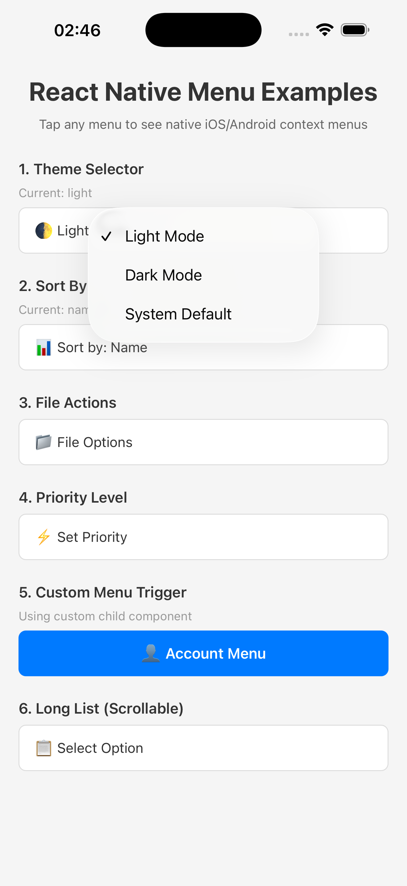
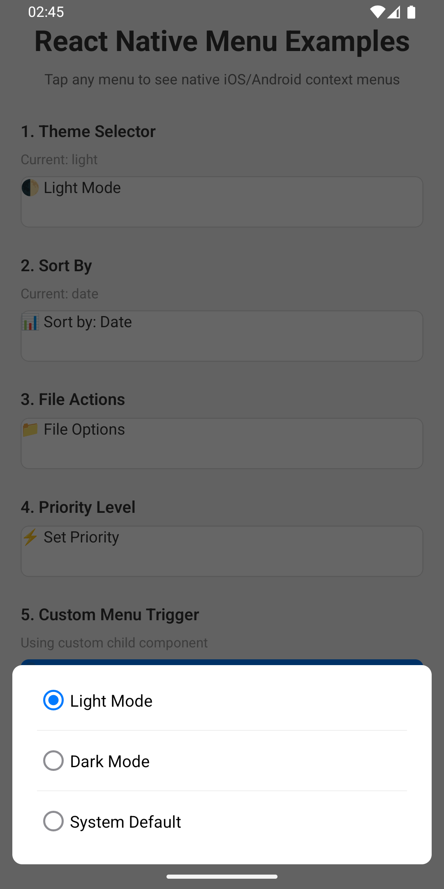

# React Native Menus

A native menu component for React Native that provides platform-specific context menus for both Android and iOS. Pass any custom component as a child to trigger native menus.

## Screenshots

<table>
  <tr>
    <td align="center">
      
      <br />
      <strong>iOS (Native UIMenu)</strong>
    </td>
    <td align="center">
      
      <br />
      <strong>Android (Modal Dialog)</strong>
    </td>
  </tr>
</table>

## Features

- ✅ Native context menu implementation (UIMenu on iOS, Modal on Android)
- ✅ Custom trigger components - pass any React Native component as a child
- ✅ Customizable colors for menu items
- ✅ Checkmark support with custom colors
- ✅ SF Symbols support on iOS (iosSymbol property)
- ✅ Subtitle support for menu items
- ✅ Destructive action styling (Red text)
- ✅ Theme variant support (Light/Dark/System)
- ✅ Scrollable menus for long lists
- ✅ Event handling for menu item selection
- ✅ TypeScript support
- ✅ Fabric (New Architecture) compatible
- ✅ Improved Accessibility support

## Installation

```bash
npm install react-native-menus
# or
yarn add react-native-menus
```

### iOS Setup

For iOS, run:

```bash
cd ios && pod install
```

### Android Setup

No additional setup required for Android.

## Usage

### Basic Example

```tsx
import React, { useState } from 'react';
import { View, Text, StyleSheet } from 'react-native';
import { MenuView } from 'react-native-menus';

const App = () => {
  const [selectedTheme, setSelectedTheme] = useState('system');

  const handleMenuSelect = (event: {
    nativeEvent: { identifier: string; title: string };
  }) => {
    setSelectedTheme(event.nativeEvent.identifier);
    console.log('Selected:', event.nativeEvent.title);
  };

  return (
    <View style={styles.container}>
      <MenuView
        checkedColor="#007AFF"
        uncheckedColor="#8E8E93"
        menuItems={[
          { identifier: 'light', title: 'Light Mode' },
          { identifier: 'dark', title: 'Dark Mode' },
          { identifier: 'system', title: 'System Default' },
        ]}
        onMenuSelect={handleMenuSelect}
      >
        <View style={styles.menuButton}>
          <Text style={styles.menuButtonText}>
            🌓 Theme: {selectedTheme}
          </Text>
        </View>
      </MenuView>
    </View>
  );
};

const styles = StyleSheet.create({
  container: {
    flex: 1,
    justifyContent: 'center',
    alignItems: 'center',
  },
  menuButton: {
    backgroundColor: '#fff',
    paddingHorizontal: 20,
    paddingVertical: 12,
    borderRadius: 8,
    borderWidth: 1,
    borderColor: '#ddd',
  },
  menuButtonText: {
    fontSize: 16,
    color: '#333',
  },
});

export default App;
```

### Controlled Selection (Recommended)

Use the `selectedIdentifier` prop to fully control which item is marked as selected. Update it in your `onMenuSelect` handler to keep iOS and Android behavior consistent.

```tsx
const [selectedSort, setSelectedSort] = useState('date');

<MenuView
  selectedIdentifier={selectedSort}
  menuItems={[
    { identifier: 'date', title: 'Date' },
    { identifier: 'name', title: 'Name' },
    { identifier: 'size', title: 'Size' },
  ]}
  onMenuSelect={({ nativeEvent }) => setSelectedSort(nativeEvent.identifier)}
>
  <View style={styles.menuButton}>
    <Text>📊 Sort by: {selectedSort}</Text>
  </View>
</MenuView>
```

### Custom Styled Trigger

```tsx
<MenuView
  menuItems={[
    { identifier: 'profile', title: 'View Profile' },
    { identifier: 'settings', title: 'Settings' },
    { identifier: 'logout', title: 'Logout' },
  ]}
  onMenuSelect={handleMenuSelect}
>
  <View style={styles.customButton}>
    <Text style={styles.customButtonText}>👤 Account Menu</Text>
  </View>
</MenuView>
```

### Long Scrollable List

```tsx
<MenuView
  checkedColor="#5856D6"
  menuItems={[
    { identifier: 'opt1', title: 'Option 1' },
    { identifier: 'opt2', title: 'Option 2' },
    // ... many more items
    { identifier: 'opt20', title: 'Option 20' },
  ]}
  onMenuSelect={handleMenuSelect}
>
  <View style={styles.menuButton}>
    <Text>📋 Select Option</Text>
  </View>
</MenuView>
```

### Disabled Menu

```tsx
const [isDisabled, setIsDisabled] = useState(false);

<MenuView
  disabled={isDisabled}
  menuItems={[
    { identifier: 'enable', title: 'Enable Menu' },
    { identifier: 'disable', title: 'Disable Menu' },
  ]}
  onMenuSelect={({ nativeEvent }) => {
    setIsDisabled(nativeEvent.identifier === 'disable');
  }}
>
  <View style={[styles.menuButton, isDisabled && styles.disabledButton]}>
    <Text style={[styles.menuButtonText, isDisabled && styles.disabledText]}>
      {isDisabled ? '🔒 Menu Disabled' : '🔓 Menu Enabled'}
    </Text>
  </View>
</MenuView>

// Add these styles
const styles = StyleSheet.create({
  // ... other styles
});
```

## API Reference

### MenuView Props

| Prop | Type | Default | Description |
|------|------|---------|-------------|
| `menuItems` | `MenuItem[]` | `[]` | Array of menu items to display |
| `title` | `string` | `undefined` | Title of the menu (Android only) |
| `androidDisplayMode` | `'dialog' \| 'tooltip'` | `'dialog'` | Display mode for the menu on Android (Android only) |
| `themeVariant` | `'light' \| 'dark' \| 'system'` | `'system'` | Theme variant for the menu background and text (Android only) |
| `selectedIdentifier` | `string` | `undefined` | Identifier of the currently selected item |
| `checkedColor` | `string` | `'#007AFF'` | Color of the checkmark for selected items |
| `uncheckedColor` | `string` | `'#8E8E93'` | Color of the checkmark for unselected items (Android only) |
| `color` | `string` | `undefined` | Tint color for the menu button text (if using default button) |
| `disabled` | `boolean` | `false` | Whether the menu is disabled |
| `onMenuSelect` | `(event: NativeSyntheticEvent<MenuSelectEvent>) => void` | `undefined` | Callback when a menu item is selected |

### MenuItem Object

| Property | Type | Description |
|----------|------|-------------|
| `identifier` | `string` | Unique identifier for the item |
| `title` | `string` | Text to display |
| `subtitle` | `string` | Subtitle text (optional) |
| `destructive` | `boolean` | Whether the item represents a destructive action (red text) |
| `iosSymbol` | `string` | SF Symbol name (iOS only) |

## Contributing

See the [contributing guide](CONTRIBUTING.md) to learn how to contribute to the repository and the development workflow.

## License

MIT
