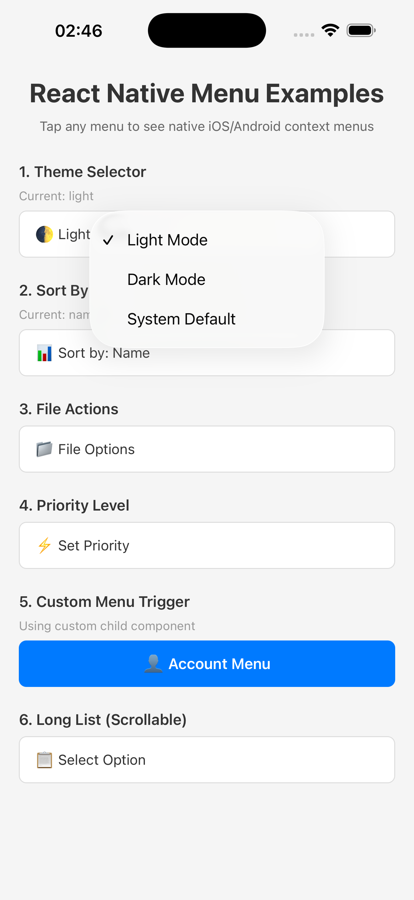
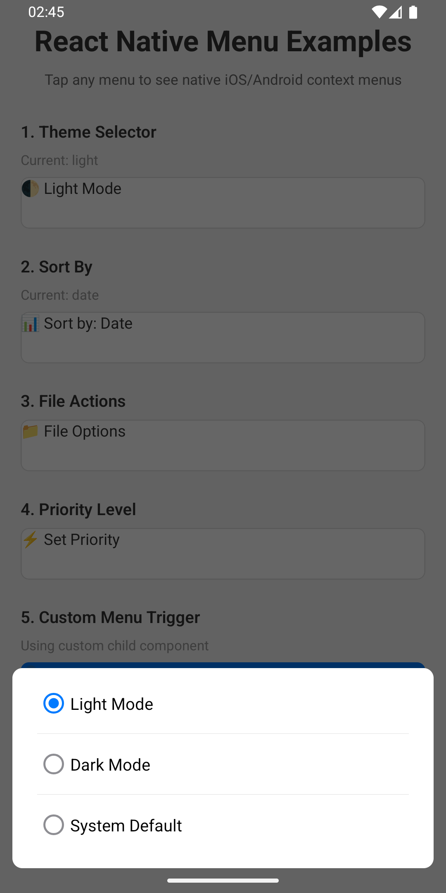

# React Native Menus

A native menu component for React Native that provides platform-specific context menus for both Android and iOS. Pass any custom component as a child to trigger native menus.

## Screenshots

<table>
  <tr>
    <td align="center">
      
      <br />
      <strong>iOS (Native UIMenu)</strong>
    </td>
    <td align="center">
      
      <br />
      <strong>Android (Modal Dialog)</strong>
    </td>
  </tr>
</table>

## Features

- ✅ Native context menu implementation (UIMenu on iOS, Modal on Android)
- ✅ Custom trigger components - pass any React Native component as a child
- ✅ Customizable colors for menu items
- ✅ Checkmark support with custom colors
- ✅ SF Symbols support on iOS (iosSymbol property)
- ✅ Subtitle support for menu items
- ✅ Destructive action styling (Red text)
- ✅ Theme variant support (Light/Dark/System)
- ✅ Scrollable menus for long lists
- ✅ Event handling for menu item selection
- ✅ TypeScript support
- ✅ Fabric (New Architecture) compatible
- ✅ Improved Accessibility support

## Installation

```bash
npm install react-native-menus
# or
yarn add react-native-menus
```

### iOS Setup

For iOS, run:

```bash
cd ios && pod install
```

### Android Setup

No additional setup required for Android.

## Usage

### Basic Example

```tsx
import React, { useState } from 'react';
import { View, Text, StyleSheet } from 'react-native';
import { MenuView } from 'react-native-menus';

const App = () => {
  const [selectedTheme, setSelectedTheme] = useState('system');

  const handleMenuSelect = (event: {
    nativeEvent: { identifier: string; title: string };
  }) => {
    setSelectedTheme(event.nativeEvent.identifier);
    console.log('Selected:', event.nativeEvent.title);
  };

  return (
    <View style={styles.container}>
      <MenuView
        checkedColor="#007AFF"
        uncheckedColor="#8E8E93"
        menuItems={[
          { identifier: 'light', title: 'Light Mode' },
          { identifier: 'dark', title: 'Dark Mode' },
          { identifier: 'system', title: 'System Default' },
        ]}
        onMenuSelect={handleMenuSelect}
      >
        <View style={styles.menuButton}>
          <Text style={styles.menuButtonText}>
            🌓 Theme: {selectedTheme}
          </Text>
        </View>
      </MenuView>
    </View>
  );
};

const styles = StyleSheet.create({
  container: {
    flex: 1,
    justifyContent: 'center',
    alignItems: 'center',
  },
  menuButton: {
    backgroundColor: '#fff',
    paddingHorizontal: 20,
    paddingVertical: 12,
    borderRadius: 8,
    borderWidth: 1,
    borderColor: '#ddd',
  },
  menuButtonText: {
    fontSize: 16,
    color: '#333',
  },
});

export default App;
```

### Controlled Selection (Recommended)

Use the `selectedIdentifier` prop to fully control which item is marked as selected. Update it in your `onMenuSelect` handler to keep iOS and Android behavior consistent.

```tsx
const [selectedSort, setSelectedSort] = useState('date');

<MenuView
  selectedIdentifier={selectedSort}
  menuItems={[
    { identifier: 'date', title: 'Date' },
    { identifier: 'name', title: 'Name' },
    { identifier: 'size', title: 'Size' },
  ]}
  onMenuSelect={({ nativeEvent }) => setSelectedSort(nativeEvent.identifier)}
>
  <View style={styles.menuButton}>
    <Text>📊 Sort by: {selectedSort}</Text>
  </View>
</MenuView>
```

### Custom Styled Trigger

```tsx
<MenuView
  menuItems={[
    { identifier: 'profile', title: 'View Profile' },
    { identifier: 'settings', title: 'Settings' },
    { identifier: 'logout', title: 'Logout' },
  ]}
  onMenuSelect={handleMenuSelect}
>
  <View style={styles.customButton}>
    <Text style={styles.customButtonText}>👤 Account Menu</Text>
  </View>
</MenuView>
```

### Long Scrollable List

```tsx
<MenuView
  checkedColor="#5856D6"
  menuItems={[
    { identifier: 'opt1', title: 'Option 1' },
    { identifier: 'opt2', title: 'Option 2' },
    // ... many more items
    { identifier: 'opt20', title: 'Option 20' },
  ]}
  onMenuSelect={handleMenuSelect}
>
  <View style={styles.menuButton}>
    <Text>📋 Select Option</Text>
  </View>
</MenuView>
```

### Disabled Menu

```tsx
const [isDisabled, setIsDisabled] = useState(false);

<MenuView
  disabled={isDisabled}
  menuItems={[
    { identifier: 'enable', title: 'Enable Menu' },
    { identifier: 'disable', title: 'Disable Menu' },
  ]}
  onMenuSelect={({ nativeEvent }) => {
    setIsDisabled(nativeEvent.identifier === 'disable');
  }}
>
  <View style={[styles.menuButton, isDisabled && styles.disabledButton]}>
    <Text style={[styles.menuButtonText, isDisabled && styles.disabledText]}>
      {isDisabled ? '🔒 Menu Disabled' : '🔓 Menu Enabled'}
    </Text>
  </View>
</MenuView>

// Add these styles
const styles = StyleSheet.create({
  // ... other styles
});
```

### Imperative Usage (Programmatic Open/Close)

You can use a ref to open or close the menu programmatically.

```tsx
import React, { useRef } from 'react';
import { View, Button } from 'react-native';
import { MenuView, type NativeRef } from 'react-native-menus';

const App = () => {
  const menuRef = useRef<NativeRef>(null);

  return (
    <View>
      <Button 
        title="Open Menu" 
        onPress={() => menuRef.current?.open()} 
      />
      <Button 
        title="Close Menu" 
        onPress={() => menuRef.current?.close()} 
      />

      <MenuView
        ref={menuRef}
        menuItems={[
          { identifier: 'item1', title: 'Item 1' },
          { identifier: 'item2', title: 'Item 2' },
        ]}
        onMenuSelect={(event) => {
          console.log('Selected:', event.nativeEvent.title);
        }}
      >
        <View style={{ width: 100, height: 100, backgroundColor: 'red' }} />
      </MenuView>
    </View>
  );
};
```

#### Ref methods

| Method | Description |
|--------|-------------|
| `open()` | Opens the menu. No-op while `disabled`, or if the menu is already open. |
| `close()` | Dismisses the menu if it is currently open. |

> **iOS requires 17.4 or newer for `open()`.** iOS presents a `UIButton`'s menu through
> UIKit's own context-menu gesture, and `UIControl.performPrimaryAction` — the only public
> API that triggers it — was added in 17.4. On earlier versions `open()` logs a warning and
> does nothing; the menu still opens on tap. `close()` works on all supported versions.

**Note:** attaching a `ref` gives you `{ open, close }` rather than the underlying native
view. If you previously relied on `ref.current` for `measure()` or `findNodeHandle()`, wrap
the `MenuView` in a plain `View` and measure that instead.

## API Reference

### MenuView Props

| Prop | Type | Default | Description |
|------|------|---------|-------------|
| `menuItems` | `MenuItem[]` | `[]` | Array of menu items to display |
| `title` | `string` | `undefined` | Title of the menu (Android only) |
| `androidDisplayMode` | `'dialog' \| 'tooltip'` | `'dialog'` | Display mode for the menu on Android (Android only) |
| `themeVariant` | `'light' \| 'dark' \| 'system'` | `'system'` | Theme variant for the menu background and text (Android only) |
| `selectedIdentifier` | `string` | `undefined` | Identifier of the currently selected item |
| `checkedColor` | `string` | `'#007AFF'` | Color of the checkmark for selected items |
| `uncheckedColor` | `string` | `'#8E8E93'` | Color of the checkmark for unselected items (Android only) |
| `color` | `string` | `undefined` | Tint color for the menu button text (if using default button) |
| `disabled` | `boolean` | `false` | Whether the menu is disabled |
| `onMenuSelect` | `(event: NativeSyntheticEvent<MenuSelectEvent>) => void` | `undefined` | Callback when a menu item is selected |
| `accessibilityLabel` | `string` | derived | What a screen reader announces for the trigger — see [Accessibility](#accessibility) |
| `menuAccessibilityHint` | `string` | `'Opens a menu'` | Announced after the label to explain what activating the trigger does |
| `enforceMinimumTouchTarget` | `boolean` | `true` | Expands the trigger's *hit area* to 44pt (iOS) / 48dp (Android). Never changes layout |

All standard React Native `ViewProps` are supported, including `testID` and `accessibilityLabel`.

### MenuItem Object

| Property | Type | Description |
|----------|------|-------------|
| `identifier` | `string` | Unique identifier for the item |
| `title` | `string` | Text to display |
| `subtitle` | `string` | Subtitle text (optional) |
| `destructive` | `boolean` | Whether the item represents a destructive action (red text) |
| `iosSymbol` | `string` | SF Symbol name (iOS only) |
| `accessibilityLabel` | `string` | Replaces the item's announced text (defaults to `title`, then `subtitle`) |
| `accessibilityHint` | `string` | Extra guidance announced after the label |
| `testID` | `string` | Test handle for E2E frameworks — defaults to `identifier` |

## Accessibility

The trigger is exposed to screen readers as a **single button element** rather than as loose
text, so VoiceOver and TalkBack announce it as actionable, report its disabled state, and (on
Android) expose expand/collapse actions.

### How the trigger is named

`accessibilityLabel` wins if you set it. Otherwise the label falls back, in order, to:

1. the currently selected item's `accessibilityLabel`, then its `title`
2. the `title` prop
3. the text content of the children you rendered

So a menu whose trigger shows the current selection is announced correctly with no extra props.

```tsx
<MenuView
  accessibilityLabel="Advanced options"
  menuAccessibilityHint="Opens advanced actions for this item"
  menuItems={[
    {
      identifier: 'delete',
      title: 'Delete Item',
      destructive: true,
      accessibilityLabel: 'Delete item permanently',
      accessibilityHint: 'This action cannot be undone',
    },
  ]}
  onMenuSelect={handleSelect}
>
  <Text>Advanced</Text>
</MenuView>
```

### Testing menu items

Menu items are drawn by the platform's own menu, not by React views, so they aren't in the
React tree. They are still addressable from E2E frameworks that drive the UI through the
accessibility layer (Detox, Appium, XCUITest): each item exposes a test handle, defaulting to
its `identifier`, so no extra props are needed.

```tsx
menuItems={[
  { identifier: 'delete', title: 'Delete' },                        // handle: "delete"
  { identifier: 'share', title: 'Share', testID: 'menu-share' },    // handle: "menu-share"
]}
```

It surfaces as `accessibilityIdentifier` on iOS and as `resource-id` on Android — the same
place React Native puts `testID`, so it does not pollute the accessibility label.

One limitation: on Android with `androidDisplayMode="tooltip"` the rows are `MenuItem`s rather
than views and have nowhere to carry a resource id, so test handles are unavailable in that
mode. Match on the item's text there instead.

### Target size

`enforceMinimumTouchTarget` (on by default) grows the trigger's touch and screen-reader
activation area to the WCAG 2.2 minimum of 44pt on iOS and 48dp on Android when the rendered
view is smaller. It only affects hit-testing — **nothing moves on screen** — so it is safe to
leave enabled. Android menu rows also carry a 48dp minimum height.

### Platform notes

- **Android** honours the system "remove animations" setting, moves screen-reader focus into
  the dialog when it opens, and returns focus to the trigger when it closes.
- **iOS** menus are presented by UIKit, which manages its own focus and animations. Per-item
  `accessibilityLabel` is applied to the underlying `UIAction` and is honoured — an item
  announces your label instead of the default `title, subtitle` pairing (verified on iOS 26).
  This is undocumented UIKit behaviour rather than a guarantee, so treat it as an
  enhancement: keep `title` meaningful on its own.

## Contributing

See the [contributing guide](CONTRIBUTING.md) to learn how to contribute to the repository and the development workflow.

## License

MIT
